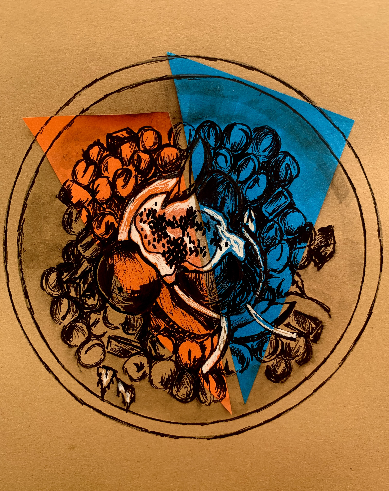
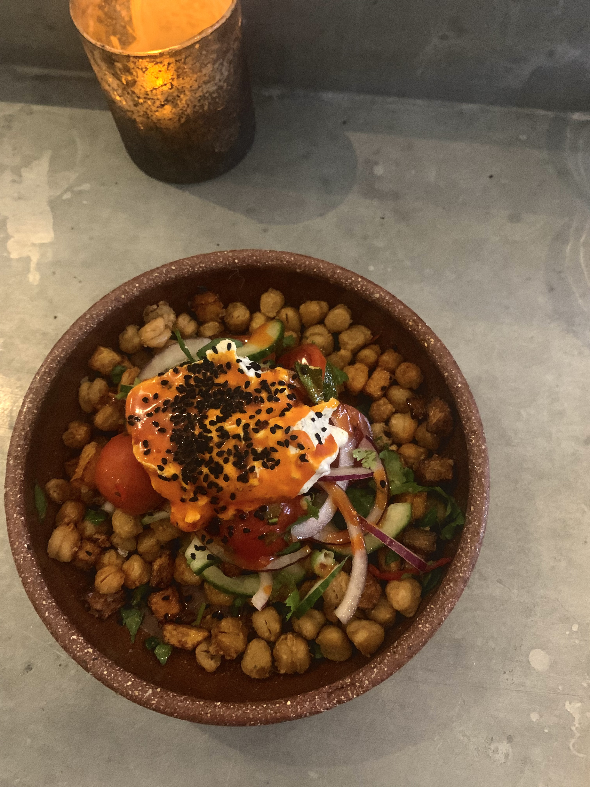
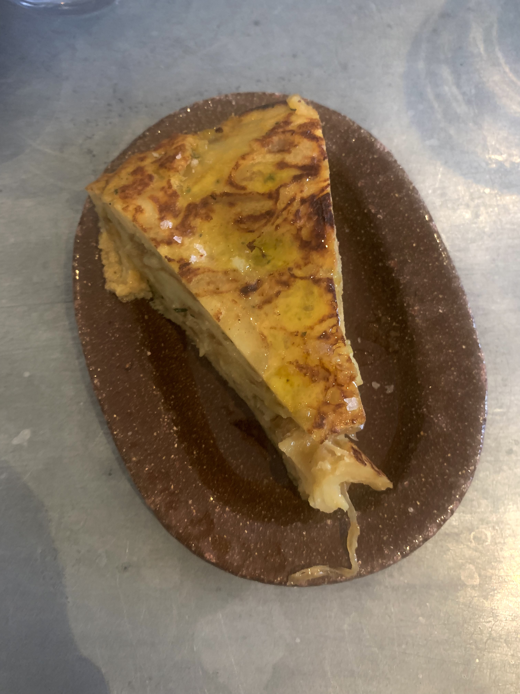
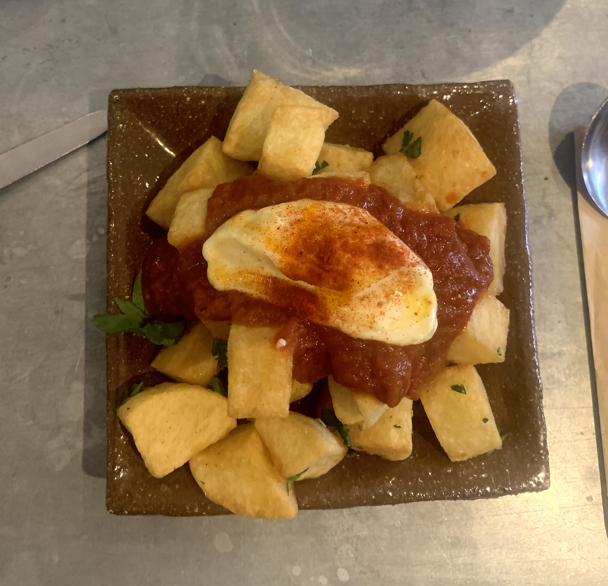
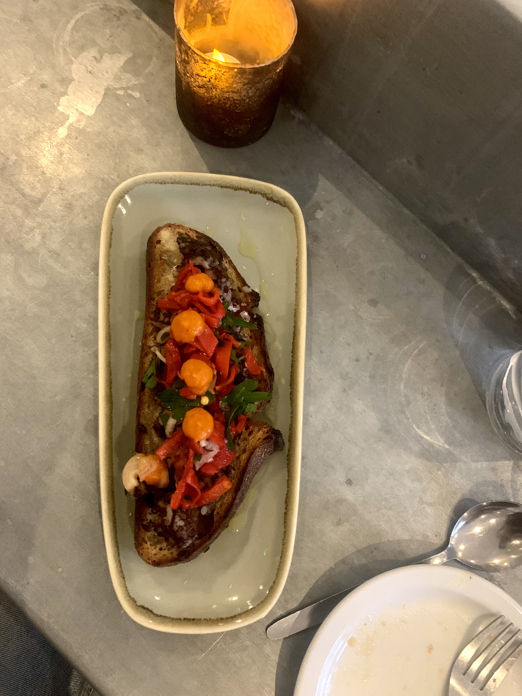

Until last year, I never thought that a favourite restaurant could become someone’s personality trait. I always assumed that would say more about me than the restaurant in question. Yet each time the word “Arbequina” is introduced into an Oxford conversation, I am met with the same response. A newfound excitement, a longstanding love, a shared understanding.

As a sister restaurant to Oli’s Thai, just a bit further down Cowley, this tapas restaurant ticks all the boxes. The two indoor dining areas offer a relaxed, clean-cut feel, as well as the outdoor tables when the weather allows. It’s so packed that getting a booking is the real test of your time management here at Oxford. Personally, I’d take a bet on a walk-in spot and if successful, you will be rewarded with a bar seat where you can watch the open kitchen in action. The only way to start your (imagined) Spanish sojourn off with is the onion tortilla. Don’t be put off by recollections of soggy quiches past and gone, instead prepare yourself for an elite wedge of perfectly understated bliss. Yes, I didn’t believe anyone could be that positive about some potatoes, eggs, onion, olive oil and sea salt either.

Then onto the patatas bravas, which admittedly is a choice which lacks bravado. It is hard to get crispy potato cubes wrong, especially when they are slathered in a spicy tomato sauce and aioli. This dish was my least favourite, which only speaks volumes for the rest of the food. Unfortunately, Spanish GCSE proves inadequate when tested out at a tapas table, and I daringly went for the morcilla, piquillo pepper and manchego tostada based on how few of the ingredients I understood. However, playing this game at Arbequina means the higher the risk, the higher the reward. The dish was essentially a posh open sandwich at its best: melted manchego, Mediterranean-style black pudding and sweet piquillo pepper pieces on top. I guess it was quite self-explanatory really. Sometimes, words just can’t do bread, meat and cheese justice.

This time, I saved the best until last. The crispy chickpea salad with herb yoghurt and a chilli butter. Yes, the texture of a roast potato can be to die for, but have you ever had the chance to eat a crispy chickpea? That is on another level. The plate was vibrant and fresh, undeniably Spanish simplicity at its best. Other contenders for top-rate small plate go to the aubergine with whipped feta, and the beetroot borani. It’s worth having a look at their Instagram page @arbequinaoxford, but only do this on a Thursday, Friday or Saturday when you can make visiting a reality, otherwise it will take over your life.

A lot of people can be distrustful of tapas restaurants. The haters say that the plates are smaller, and the novelty inflates the price. For four plates and two glasses of wine, the bill came in at around £45. Seriously good value in comparison to the horrendously overpriced continental deli deal at M&S, now there’s no picnic.

The drinks are also incredibly well selected too, Arbequina exudes some serious cocktail confidence. A favourite was the basil gimlet, but the red wines that I felt I had to test out were also a far sight better than the Yellow Tail I was used to. As a mid-range option, (£6 a glass) I chose the Como Lo Haria Mi Abeulo. I didn’t even attempt the GCSE Spanish skills with this one, I just pointed at the menu. It went down a treat on my break from the library on Saturday at 4pm. Honestly, two food articles in, who do I think I am?

With lovely, knowledgeable staff and excellent food, this place has already been mentioned by the New York Times, the Michelin Guide and British Vogue, no less. All the same, I am sure that my stream of unadulterated praise is undoubtedly the thing they have been looking for. It is hard to find a bad word to say about this restaurant. Arbequina, you just can’t beat her.
