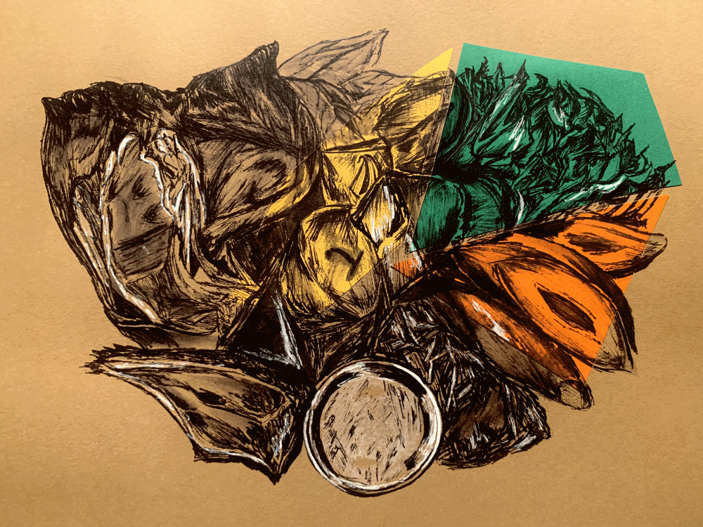

I don’t know about you, but when I sit down at the end of a long week, a hall roast dinner more suited to a hospital tray isn’t really what I’m after. A guaranteed, congealed vat of ‘gravy’, rock-hard potatoes, and school-dinner style meat and two veg just doesn’t cut the mustard. Forget the impending essay crises, JCR meetings and circuit laundry battles ; the real reason I used to dread a Sunday at this university was on account of the roast dinner.

After just a few weeks, I decided to put these culinary failures in college behind me. I began my most sustained academic work to date, the search for Oxford’s best Sunday lunch. Bizarrely, I failed to secure any university funding for this project, so I had to have a very careful selection process. The Perch was too far, The Magdalen Arms would bankrupt me and The Port Mahon had run out of potatoes, so I decided to take a chance on the Chester Arms.

This place is certainly one of East Oxford’s hidden gems. The cosy interior is decked with fairy lights and some trendy local artwork, which is perfect for a Michaelmas pub night with friends, or a date who you want to impress. They even have a gorgeous outdoor seating area, if you feel like you want to test out those new college puffers!

As a seasoned (sad) restaurant ‘enthusiast’, I had of course already fully browsed the menu as part of my research. On that particular week there was a choice of a whole roast chicken for two to three people, or individual plates of beef, pork or nut roast wellington if you didn’t fancy sharing — everything was just as Sunday pub grub should be. As the first sight of my roast beef arriving, I was already entering into the early stages of a food coma. Set before me, there were two thick slices of pink beef, no fewer than six roast potatoes, freshly cooked vegetables, cauliflower cheese and a Yorkshire pudding bigger than my head. I didn’t know where to start. Right then, all I knew was that I had found something rare on this plate: a state of peace, content and homely happiness that feels unfamiliar almost anywhere else in an Oxford term.

I don’t consider myself to be a cauliflower convert just yet, though without a doubt this was the best that I had ever had. The little florets were coated in a rich mornay sauce, baked up with a crispy cheesy top, just on the right side of burnt. Maybe I just enjoyed it so much because I could barely taste the cauliflower?
Both the best and worst meals are a challenge to complete, and the Chester Arms’ Sunday roast was unfinishable for the right reasons. For my £15, there were definitely over two meals worth of food on that plate. If only I could have envisaged the generosity of the portion, I would have mentally prepared for it, but I guess it’s all about learning on the job.

Sadly, there was no room for more; it was one of the few occasions where I am sure dessert would have been a dangerous idea. Their offerings of a brownie or a banana split seem a bit safe, but I have faith that these people know what they are doing. What I am most excited to try next are the midweek platters that they have on offer. Against all my food intuitions, sharing really is caring at The Chester. The veggie mezze promises to be piled high with Middle Eastern marinated bits such as aubergines, yoghurts, lentils, olives, salads and homemade flatbreads. Or for a special treat, go for Hamzah’s Steak Platter (established 2009). To have survived the last ten years, it really must have been through a lot, not to mention a pandemic, and that “est.” really gives it the respect it deserves. A medium rare steak complete with Chester chips, cabbage and bacon and a Béarnaise sauce sounds superb. I can’t wait to get back to try their take on the classic, and based on my last visit, the steaks are high.
