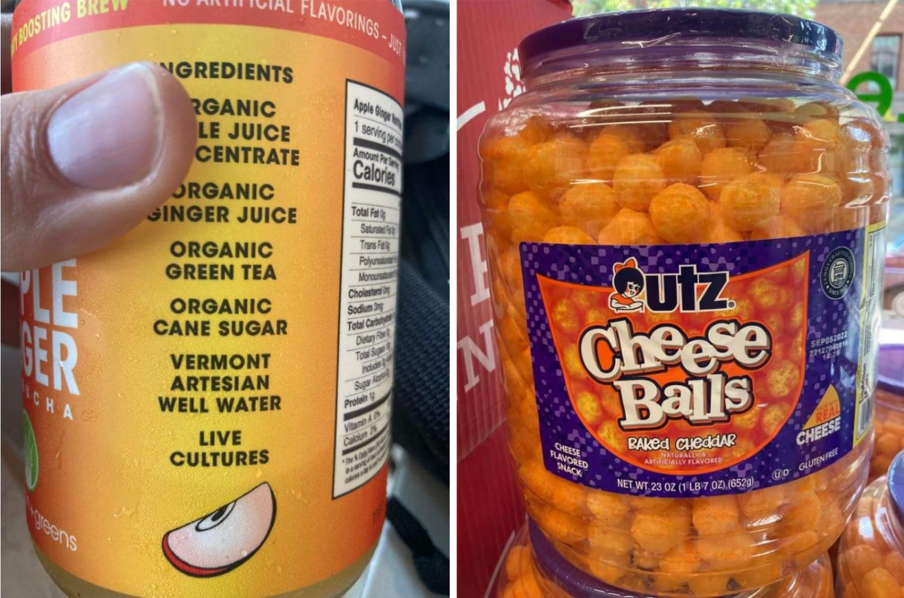
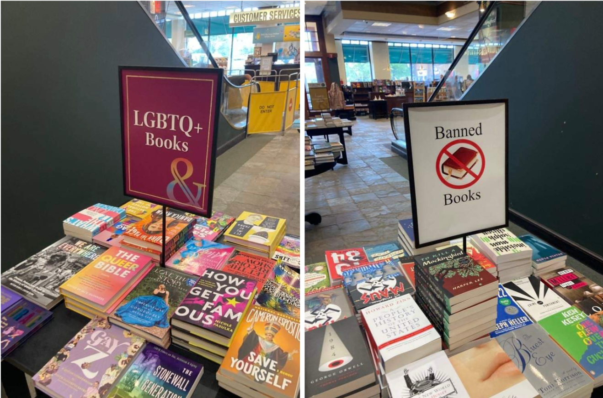
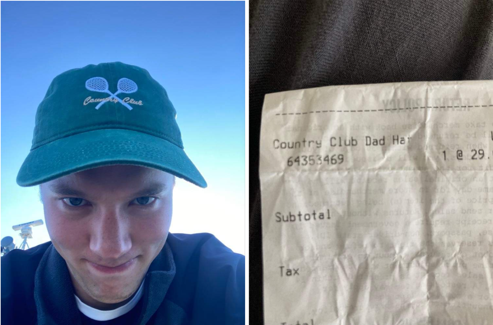
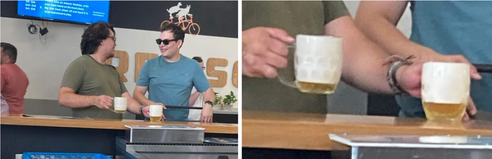
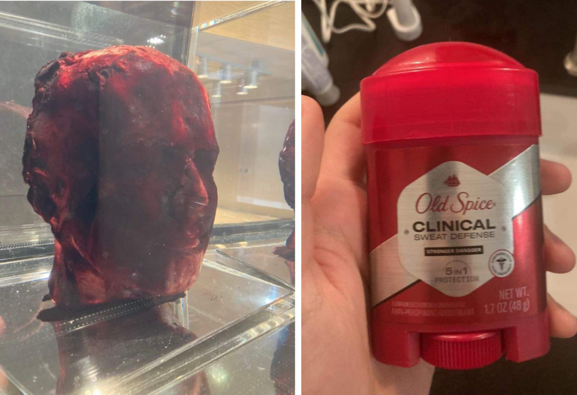
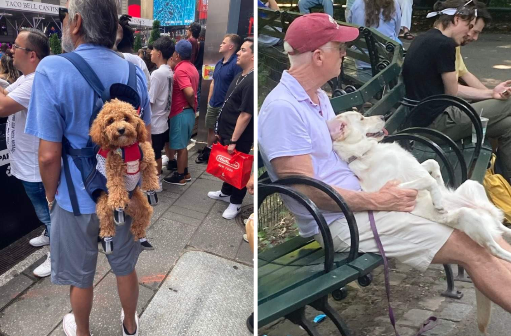
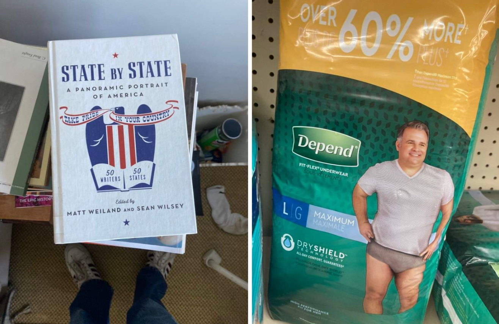
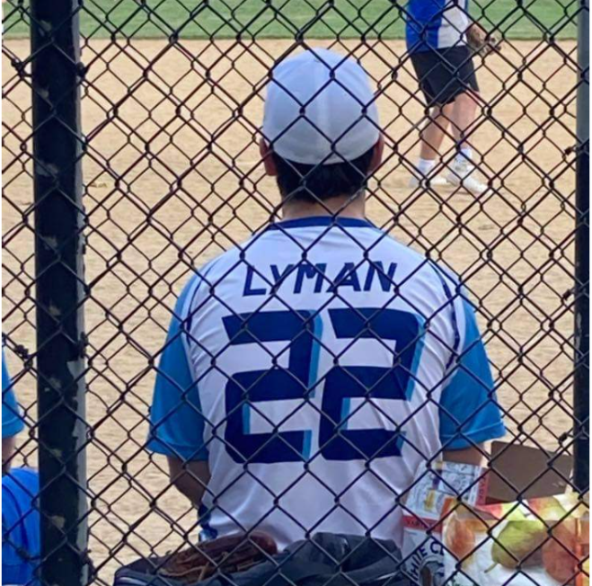
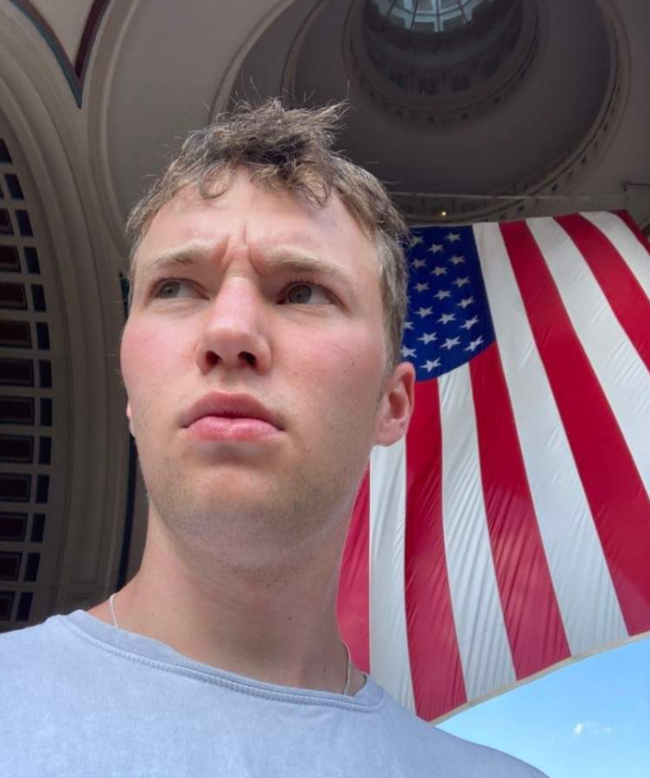
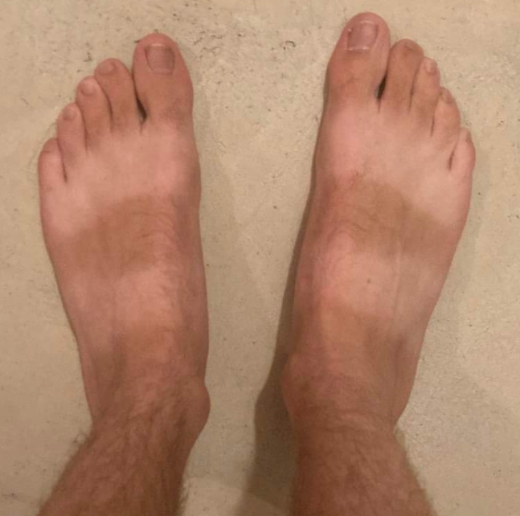

I hate blogs. I especially hate reading other people's blogs, which more often than not are poorly written and uninteresting. Travel blogs, I suspect, are the worst - the written equivalent of a photo of a plane wing. Bloggers believe themselves to be above the cess-pit of social media, but it's all the same. Instead of scrolling through photos on Instagram of people having a better time than you, simply read about how they found a charming little restaurant tucked away behind the piazza where they sampled the most authentic cannoli in all of bella Italia. Besides, it's a terribly ugly word. Ugly blogs and uglier bloggers. 

Welcome to my blog. I'll make some assurances from the start. The entries will be short. They will include pictures. I will never earnestly claim to have had the best pizza, coffee, caesar salad etc. in my life. Primarily this will be for my benefit, more so than yours. My greatest regret from my last few years at university was that I failed to keep a diary, and have since forgotten all of the hilarious and witty things I did and said. Why a blog and not a diary then? Narcissism. I figure that if I know that I will be receiving a modicum of attention from keeping track of my activities, I will be much more dutiful in doing so.

I should probably explain what I am actually doing. I am travelling around the US (blessed country), on a travel grant from Balliol (blessed college), in order to grow and develop myself (blessed crap). The destinations I am travelling to (roughly New England, Bible Belt, Middle of Nowhere, Toronto) is largely decided by where there are hosts. These kind and generous hosts are old members of Balliol themselves. They house, feed, natter and chatter with us Pathfinders. Pathfinders? No, no, no, not the model of Nissan compact SUV which first went into production in 1985. No silly, nor the 2007 film of a young Viking boy raised by a tribe of hostile native Americans, starring literally nobody you would have ever heard of.

I will, for those interested, explain the story behind, and the value in, the Balliol pathfinders programme in a future blog (probably not). By now, I would've stopped reading most blogs, so here is where I'll end this first, introductory post. I have already been in the USA for nearly three weeks now, so there will be some retrospective entries summing up my time in Vermont, Boston, New Haven, and New York City shortly.

Here is a collection of photos of my time so far to give you a soupcon (googled spelling, double-checked meaning, couldn't find the accent) of my time so far.

**Interesting food:** Note the ingredient of ‘Vermont Artesian Well Water’. I can’t read the brand of cheese balls as anything but ‘nutz’.

**Books:** After I took this photo I swapped the signs around.

**Cap:** I bought this cap in Burlington, Vermont. My cousin thought it was hilariously sad and called me a ‘clown’. I was insistent that it was a la mode, but later found the receipt, and was rather deflated to discover it was a ‘dad hat’.

**Two disgusting things:** These two men, and I say this with full sincerity, are the most ignorant and stupid people I have ever seen. Look how pleased they are with those beers. The barmaid told me that the foam was 90% beer.

**Two more disgusting things:** A piece of artwork by the artist Marc Quinn in the Yale Museum of British Art. It is a model of his head filled with ten pints of his own blood. The second is a stick of clinical deodorant I have bought in preparation for Texas. The products were kept behind locked plastic shields. I had to point out my choice of clinical deodorant to the employee, who became increasingly red as she held her breath during the course of our interaction.

**Two dogs:** two dogs

**Two items:** An item I bought and left at home. An Item I didn’t buy, but wish I did.

**A long-lost relative?:** Wandering through Central Park I heard my name being called. This time not a delusional daydream of fame, but a nearby baseball match.

**Selfie:** During this photo I momentarily forgot where I was

**Foot funds:** My Birkenstocks have left me with a rather peculiar tan-line. I have many more photos of these puppies if anyone is willing to pay.

Bye,\
**Fred**

*N.B.* Ed, my boyfriend, (or my 'friend' as he is to some people I meet out here), kindly set up this website for me. Unfortunately it has no spellchecker, which I have just discovered in the last few minutes I am heavily reliant on. So far I have had to double-check the spelling of 'restaurant', 'cannoli', and 'narcissism'. I obviously knew how to spell them, obviously. I just wanted to be sure.